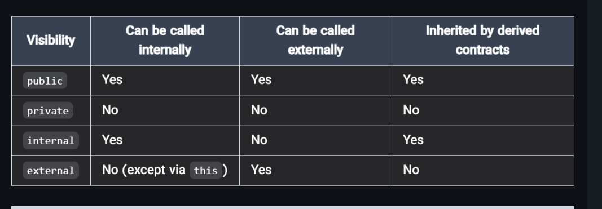

### **Comparison of Function Visibility**

-----------------

1.  **Public**

    -   Accessible by:
        -   Anyone
        -   Other contracts
        -   The contract itself
2.  **External**

    -   Accessible by:
        -   Only other contracts, unless using this.functionName().
3.  **Internal**

    -   Accessible by:
        -   The smart contract itself
        -   Contracts that inherit from it
4.  **Private**

    -   Accessible by:
        -   Only the smart contract itself